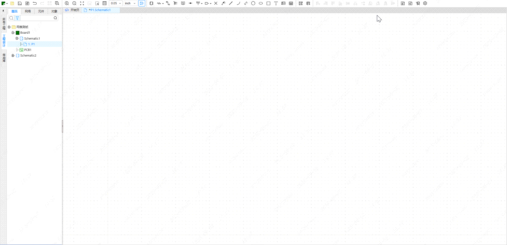

# Netlist to Schematic Reconstruction Extension

[中文](./README.md)

Import netlist files and automatically reconstruct schematics. Supports component search, intelligent placement, and net connections.

## Main Features

- Import netlist files (supports .json and .enet formats)
- Automatically search and place components
- Intelligently create net wires
- Automatically update component attributes

## Usage

1. Prepare a netlist file (.json or .enet format)
2. Select **"Netlist Reconstruction"** > **"Import Netlist File"** from the menu bar
3. Select or drag and drop the file, then click **"Confirm Import"**
4. Confirm to start schematic reconstruction

## Netlist File Format

Supports netlist files in JLCPCB EDA Pro format.

```json
{
	"器件ID": {
		"props": {
			"Designator": "器件标识符",
			"DeviceName": "器件名称",
			"Value": "器件值",
			"Supplier Part": "供应商料号"
		},
		"pins": {
			"引脚号": "网络名称"
		}
	}
}
```

## Demo


