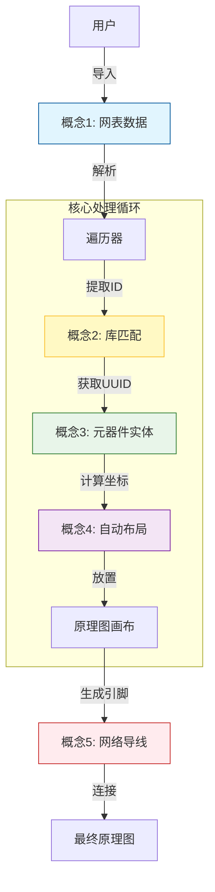
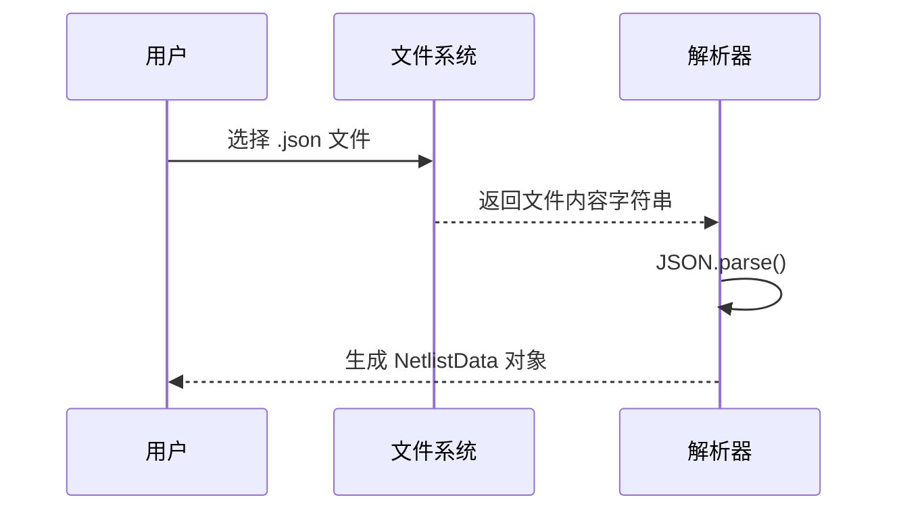
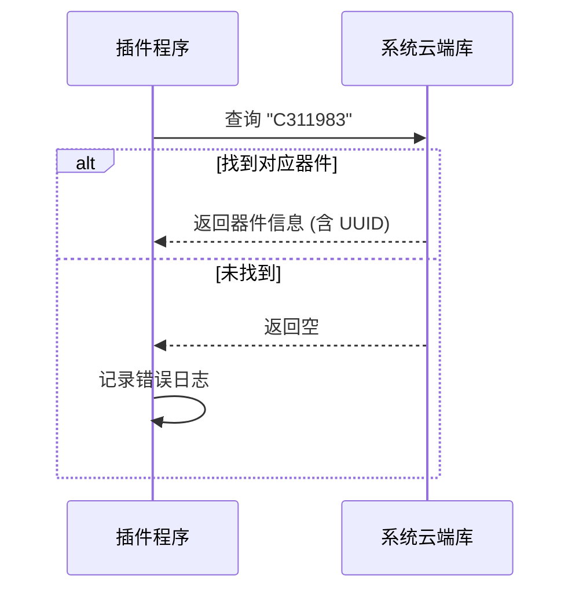
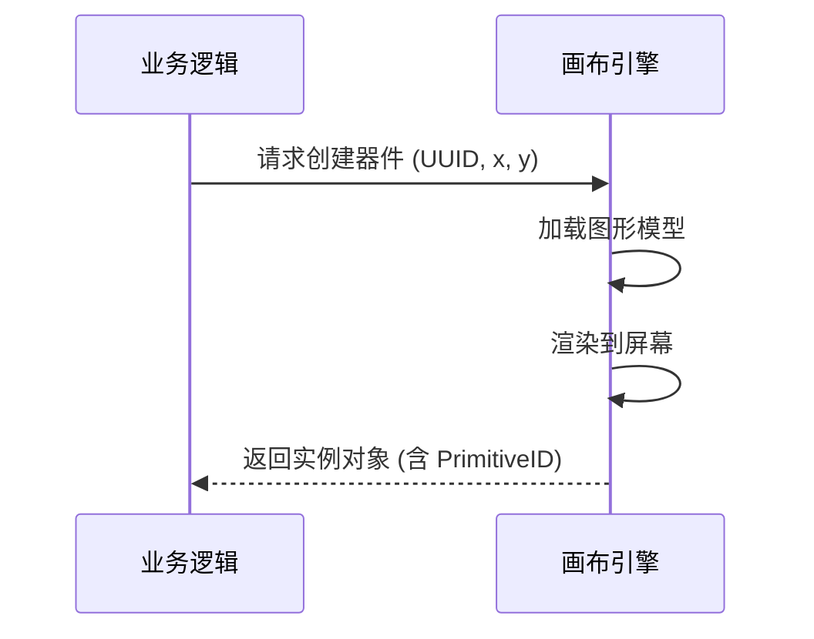
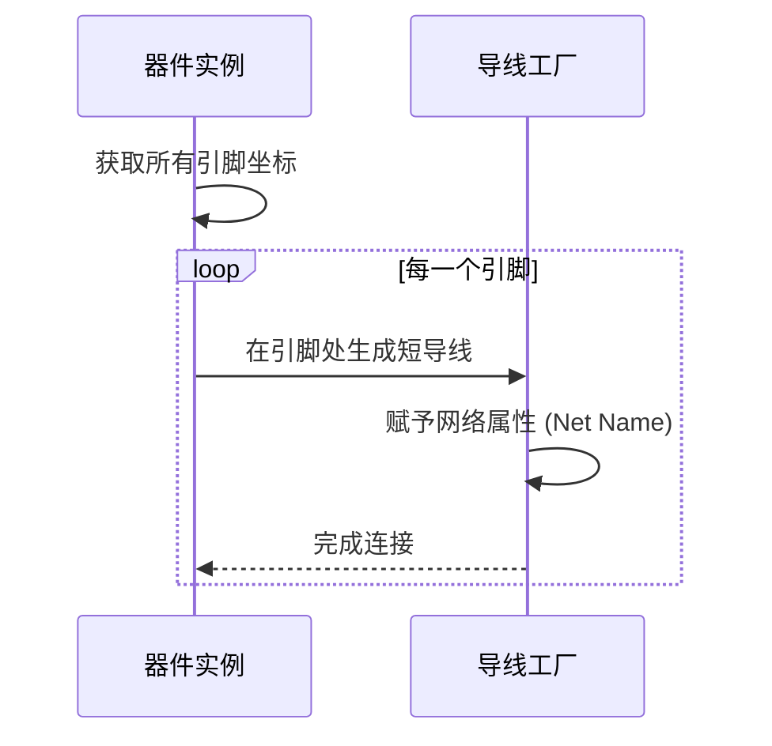

# 项目核心概念入门教程：从网表到原理图的魔法之旅

> **导读者**：你好！我是你的技术向导。今天我们将一起探索 `eext-generate-schematic-from-netlist` 这个项目。这不仅仅是一段代码，它是一个将枯燥数据转化为可视化电路图的"数字魔法师"。我们将通过 5 个核心概念，带你彻底读懂它的内心世界。

---

## 1. 项目背景与学习目标

### 🛠️ 核心问题：它解决了什么？

在电子设计中，如果你手头只有一份"元器件清单和连接关系"（网表），手动在原理图软件里一个一个画出来是非常痛苦的。**本项目的核心目标就是：自动化！** 它读取网表文件，自动帮你把元器件摆好，并把线连上。

### 🎯 学习目标

通过本教程，你将掌握以下核心机制：

1. 理解数据是如何被摄入的（网表）。
2. 理解虚拟数据如何变成实体对象（库匹配与实例化）。
3. 理解机器如何决定物体的位置（自动布局）。
4. 理解连接关系是如何建立的（网络导线）。

---

## 2. 概念关系总览图

这是一张项目的"大脑地图"，展示了各概念如何协作完成任务。



---

## 3. 章节导航 (最佳学习路径)

为了让你最轻松地理解，我们按照**"数据流动 -> 实体构建 -> 空间排布 -> 电气连接"**的逻辑进行讲解：

1.  **[概念 1: 网表数据 (Netlist Data)](#1-网表数据-netlist-data)** - 一切的起点，数据的蓝图。
2.  **[概念 2: 库匹配 (Library Match)](#2-库匹配-library-match)** - 从数据到现实的桥梁。
3.  **[概念 3: 元器件实体 (Primitive Component)](#3-元器件实体-primitive-component)** - 在画布上创造物体。
4.  **[概念 4: 自动布局 (Auto Layout)](#4-自动布局-auto-layout)** - 让物体井井有条。
5.  **[概念 5: 网络导线 (Net Wire)](#5-网络导线-net-wire)** - 赋予电路灵魂的血管。

---

## 4. 正文内容

### 1. 网表数据 (Netlist Data)

#### 🤔 Why: 为什么需要它？

如果没有网表，程序就不知道要画什么。它是建筑的**蓝图**。如果不定义清晰的数据结构，程序读入的内容就是一堆乱码。

#### 💡 Analogy: 生活类比

想象你去宜家买家具，**网表**就是那张**购物清单+组装说明书**。

- `props` (属性)：告诉你要买"比尔书架"（型号），颜色是白色（值）。
- `pins` (引脚)：告诉你"板子A"的孔要对准"板子B"的孔。

#### 💻 Code: 极简代码

_(源码路径: `src/index.ts`)_

```typescript
// 定义每个器件长什么样
interface NetlistComponent {
	props: {
		Designator: string; // 比如 "R1", "U1" (名字)
		'Supplier Part': string; // 比如 "C311983" (商品条码)
	};
	pins: Record<string, string>; // 比如 {"1": "GND", "2": "VCC"} (连接关系)
}
```

#### 🔄 Flow: 交互流程



<br>
<p align="right"><i>既然有了清单，我们怎么找到对应的实物呢？进入下一章... 👉</i></p>

---

### 2. 库匹配 (Library Match)

#### 🤔 Why: 为什么需要它？

网表里只有字符串（比如 "C311983"），但编辑器需要知道这个元件的具体长宽、引脚位置、3D模型等信息。我们需要去**系统库**里查找。

#### 💡 Analogy: 生活类比

你拿着购物清单上的**条形码**（Supplier Part），去仓库的**电脑系统**里查询。系统会告诉你："这个货在 3排 4层"，并给你一个唯一的**取货码**（UUID）。

#### 💻 Code: 极简代码

_(源码路径: `src/index.ts` -> `findDeviceInfo`)_

```typescript
async function findDeviceInfo(component) {
	// 拿着"条形码"去系统里查
	const partCode = component.props['Supplier Part'];
	const devices = await eda.lib_Device.getByLcscIds(partCode);

	// 找到了！返回第一个匹配项（包含 UUID）
	if (devices && devices.length > 0) {
		return devices[0];
	}
	return null; // 仓库里没这货
}
```

#### 🔄 Flow: 交互流程



<br>
<p align="right"><i>找到了取货码，现在我们要把它真正地"变"到画布上... 👉</i></p>

---

### 3. 元器件实体 (Primitive Component)

#### 🤔 Why: 为什么需要它？

知道了是什么器件还不够，我们需要在原理图的画布上**创建**一个可以交互的实例。这就是"实例化"的过程。

#### 💡 Analogy: 生活类比

仓库管理员根据取货码，把**真正的椅子**（实体）搬到了你的房间里。现在它是一个占据物理空间、可以被移动的物体了。

#### 💻 Code: 极简代码

_(源码路径: `src/index.ts` -> `placeComponent`)_

```typescript
// libraryUuid: 系统库ID, uuid: 器件的取货码
// x, y: 放置的坐标
const primitiveComponent = await eda.sch_PrimitiveComponent.create({ libraryUuid: libUuid, uuid: deviceInfo.uuid }, x, y);

// 拿到它的身份证号 (Primitive ID)，后续用来改属性
const primitiveId = primitiveComponent.primitiveId;
```

#### 🔄 Flow: 交互流程



<br>
<p align="right"><i>椅子搬进来了，但不能乱堆在一起。我们要怎么摆放呢？... 👉</i></p>

---

### 4. 自动布局 (Auto Layout)

#### 🤔 Why: 为什么需要它？

如果所有器件都放在 `(0,0)` 坐标，它们会重叠在一起，变成一团乱麻。我们需要一个算法来计算每个器件应该放在哪里。

#### 💡 Analogy: 生活类比

这就好比**排排坐**。第一个人坐第一排左边，第二个人往右移一点... 第一排坐满了（比如坐了15个人），下一个人就换到第二排去坐。

#### 💻 Code: 极简代码

_(源码路径: `src/index.ts` -> `rebuildSchematic`)_

```typescript
let currentX = 20;
let currentY = 20;
const gridSize = 100; // 每个人之间的距离

// 简单的网格布局算法
if (componentCount % 15 === 0) {
	// 换行：X回到起点，Y向下移动
	currentX = 20;
	currentY += gridSize * 2;
} else {
	// 同行：X向右移动
	currentX += gridSize * 3;
}
```

#### 🔄 Flow: 交互流程

```mermaid
sequenceDiagram
    participant Loop as 循环控制器
    participant Pos as 坐标计算器

    loop 每一个器件
        Loop->>Pos: 当前排满了吗？
        alt 没满
            Pos-->>Loop: X + 300
        else 满了
            Pos-->>Loop: X 重置, Y + 200
        end
        Loop->>Loop: 放置下一个器件
    end
```

<br>
<p align="right"><i>东西都摆好了，最后一步，我们要把它们连通起来... 👉</i></p>

---

### 5. 网络导线 (Net Wire)

#### 🤔 Why: 为什么需要它？

电子元器件之间必须有电气连接才能工作。在原理图中，我们通常使用**短导线 + 网络标签 (Net Label)** 的方式来表示连接，这样比画满屏幕的飞线要整洁得多。

#### 💡 Analogy: 生活类比

给每个设备的接口上插一根**带标签的短线**。

- 设备A的端口贴着 "WIFI" 标签。
- 设备B的端口也贴着 "WIFI" 标签。
- 虽然它们之间没有长长的线连着，但我们知道它们是通的（无线连接/逻辑连接）。

#### 💻 Code: 极简代码

_(源码路径: `src/index.ts` -> `createNetWiresForSingleComponent`)_

```typescript
// 计算导线坐标：从引脚位置(startX) 延伸出去 30个单位
const endX = pinX + 30;

// 创建导线，并赋予它网络名称（如 "GND"）
// 上层系统会自动把所有叫 "GND" 的线连通
await eda.sch_PrimitiveWire.create(
	[startX, startY, endX, endY],
	netName.toUpperCase(), // 标签名大写
);
```

#### 🔄 Flow: 交互流程



---

## 5. 扩展学习建议

恭喜你！你已经掌握了自动化生成原理图的核心逻辑。如果你想更进一步，建议尝试以下挑战：

1.  **优化布局算法**：现在的布局是简单的"排排坐"，能不能按功能模块聚类布局？（提示：修改 Layout 章节的坐标计算逻辑）。
2.  **错误处理增强**：如果库匹配失败了，能不能弹窗让用户手动选择替代品？（提示：深入研究 `findDeviceInfo` 函数）。
3.  **支持更多格式**：目前支持 JSON，能不能支持 Altium Designer 的网表格式？（提示：编写新的 `Parser`）。

希望这份教程能成为你代码探索之旅的灯塔！🚀
